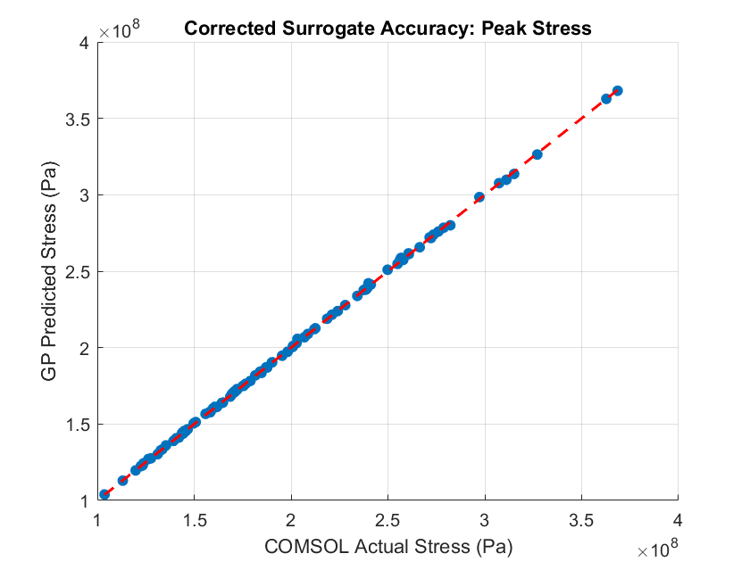
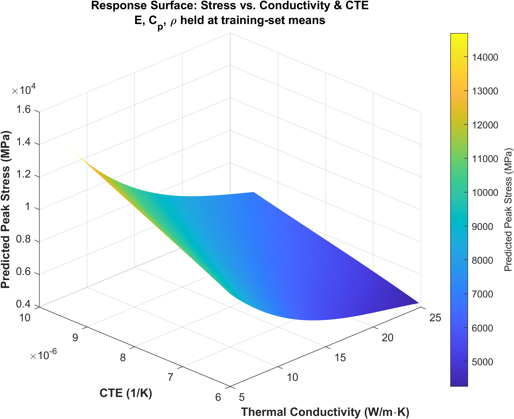
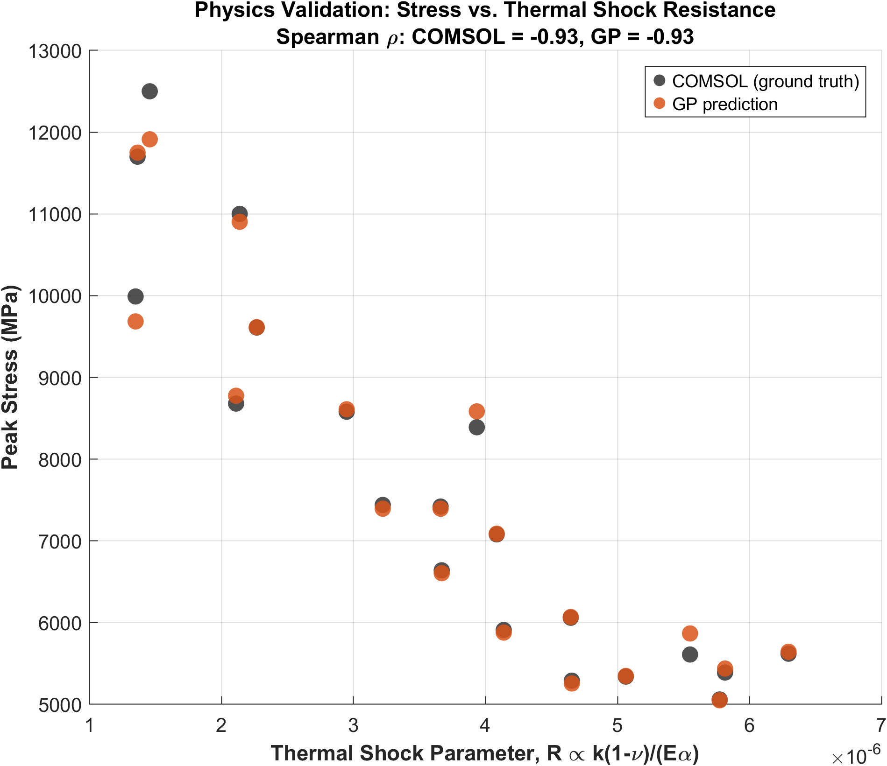

# Gaussian Process Surrogate for UHTC Thermal-Structural Response

A Gaussian Process (GP) regression surrogate that predicts **peak temperature** and **peak von Mises stress** in a simplified 2D Ultra-High Temperature Ceramic (UHTC) leading edge from five material properties. It is trained on a 100-case COMSOL Multiphysics parametric sweep of a transient, coupled thermal-structural simulation under hypersonic-level heating (temperatures up to ~4300 K).

> **Status:** proof of concept. 2D geometry, constant material properties, linear-elastic response, a single loading condition, and 100 training simulations.

---

## Contents

- [Motivation](#motivation)
- [Repository contents](#repository-contents)
- [Simulation data](#simulation-data)
- [Surrogate model](#surrogate-model)
- [Results](#results)
- [Physics consistency check](#physics-consistency-check)
- [Interpreting the numbers](#interpreting-the-numbers)
- [Limitations](#limitations)
- [Requirements and usage](#requirements-and-usage)
- [Future work](#future-work)

---

## Motivation

UHTCs (e.g., borides and carbides of Zr, Hf, and Ta) are candidate materials for hypersonic leading edges and other extreme thermal environments. Screening many material-property combinations with finite element analysis (FEA) requires one simulation per combination. A surrogate trained on a modest number of simulations can predict new combinations quickly and, because it is a GP, report a predictive uncertainty alongside each prediction.

This project tests whether a GP can learn the map from five material properties to peak thermal-structural response, and whether the learned trends agree with classical thermal-shock scaling.

---

## Repository contents

| File | Description |
| --- | --- |
| `ML_training.m` | MATLAB script: loads the data, splits it, trains the GP models, evaluates them (RMSE, uncertainty calibration), runs the physics check, and regenerates all figures. |
| `UHTC_ML_Training.csv` | COMSOL results: 100 cases × 21 time steps (2100 rows). |
| `UHTC-Surrogate-Model.mph` | COMSOL model used to generate the data. |
| `parity_plot.png` | Predicted vs. COMSOL values with ±2σ bars on the held-out test set. |
| `response_surface.png` | Predicted peak stress vs. thermal conductivity and CTE (2D slice). |
| `thermal_shock_validation.png` | Peak stress vs. the thermal-shock parameter $R$, for COMSOL and GP. |

---

## Simulation data

A coupled thermal-structural model of a simplified 2D leading edge was built in COMSOL Multiphysics (heat transfer in solids, solid mechanics, thermal expansion). A high heat flux acts on the leading-edge tip, and the resulting temperature field drives thermal strain and stress.

| Item | Value |
| --- | --- |
| Study type | Transient, 0 – 10 s, 0.5 s output step (21 time points per case) |
| Initial temperature | 293.15 K |
| Number of cases | 100, sampled with Latin hypercube sampling |
| Peak heat flux (`q_peak`) | 5 × 10⁶ W/m² (5 MW/m²) on the leading-edge tip; _TODO: state the time profile (constant or ramped)_ |
| Geometry, other boundary conditions | _TODO: add nose radius, thickness, constraints, radiation (if any)_ |
| COMSOL version | _TODO_ |
| Poisson's ratio | 0.15 (fixed; matches the value used for $R$ in `ML_training.m`) |
| Baseline parameters (sweep centers) | $k$ = 15 W/(m·K), $\alpha$ = 7.5 × 10⁻⁶ 1/K, $E$ = 450 GPa, $C_p$ = 600 J/(kg·K), $\rho$ = 7200 kg/m³ |

### Swept material properties

| Parameter | Symbol | Min | Max |
| --- | --- | --- | --- |
| Thermal conductivity | $k$ | 5.06 W/(m·K) | 24.88 W/(m·K) |
| Coefficient of thermal expansion | $\alpha$ | 6.01 × 10⁻⁶ 1/K | 9.48 × 10⁻⁶ 1/K |
| Young's modulus | $E$ | 400 GPa | 549 GPa |
| Specific heat capacity | $C_p$ | 500.7 J/(kg·K) | 698.1 J/(kg·K) |
| Density | $\rho$ | 6007 kg/m³ | 8477 kg/m³ |

### Targets

The targets are the values at the final time step (t = 10 s). In all 100 cases, the maximum temperature and the maximum von Mises stress over the 0 – 10 s window occur at t = 10 s, so the final step is the peak of this transient.

| Target | Range over all 100 cases |
| --- | --- |
| Peak temperature | 1834 – 4316 K |
| Peak von Mises stress | 4.16 – 14.6 GPa |

The CSV stores stress in Pa; the script converts to MPa for reporting and plots.

---

## Surrogate model

Two GP regression models are trained with MATLAB's `fitrgp`:

| Model | Inputs | Output |
| --- | --- | --- |
| Stress | $k, \alpha, E, C_p, \rho$ | Peak von Mises stress |
| Temperature | $k, \alpha, E, C_p, \rho$ | Peak temperature |

- **Kernel:** squared exponential (one shared length scale across inputs), hyperparameters optimized by `fitrgp`.
- **Split:** 80 / 20 hold-out (80 training, 20 test cases), `rng(42)`.
- **Preprocessing:** inputs are standardized using training-set mean and standard deviation only, so no test information leaks into the scaling. Outputs are not rescaled.
- **Uncertainty:** the GP's predictive standard deviation is used to build ±2σ intervals, whose empirical coverage is checked on the test set.

---

## Results

Performance on the 20 held-out test cases:

| Output | Test RMSE | Relative RMSE | ±2σ coverage |
| --- | --- | --- | --- |
| Peak von Mises stress | 169.32 MPa | 2.28 % | 95.0 % (19 / 20) |
| Peak temperature | 77.00 K | 3.29 % | 90.0 % (18 / 20) |

Relative RMSE is RMSE divided by the range of the test-set targets (about 5.0 – 12.5 GPa for stress and 1.9 – 4.3 × 10³ K for temperature). With only 20 test points, these numbers, especially the coverage figures, carry noticeable sampling uncertainty.

### Parity plot

### Response surface

The surface is a 2D slice through the 5D input space: $E$, $C_p$, and $\rho$ are held at their training-set means, and $k$ and $\alpha$ span their sampled ranges.

---

## Physics consistency check

Predicted stress is compared with the classical thermal-shock resistance parameter

$$R \propto \frac{k\,(1-\nu)}{E\,\alpha}$$

using the Spearman rank correlation across the 20 test cases:

| Compared with $R$ | Spearman $\rho$ |
| --- | --- |
| COMSOL ground truth | −0.93 |
| GP prediction | −0.93 |

**How to read this**

- The COMSOL data itself follows the expected inverse trend, and the GP reproduces that trend. Together these show the surrogate tracks the FEM faithfully.
- $\nu$ is not a swept parameter, so $(1-\nu)$ is a constant factor and does not affect a rank correlation.
- $R$ ignores $\rho$ and $C_p$, which influence the transient temperature field, so a correlation somewhat weaker than −1 is expected.
- Because $\sigma \sim E\alpha\,\Delta T$ and $\Delta T$ decreases with $k$, a strong inverse relation with $R$ is close to built into the governing equations. This is a consistency check on the trend, not an independent validation of the model.

---

## Interpreting the numbers

- **Stress magnitudes.** Stresses of 4 – 15 GPa come from a linear-elastic model with constant properties and no plasticity, creep, or cracking. They are far above the strength of any real ceramic, so treat them as relative indicators for comparing property combinations under the same load, not as failure predictions.
- **Temperatures.** The hottest cases reach ~4300 K (8 of 100 final temperatures exceed 3500 K, and 2 exceed 4000 K). Real UHTCs melt or sublimate in roughly this range, and the model neglects property changes with temperature, phase change, oxidation, and ablation.

---

## Limitations

- **Geometry and load:** simplified 2D leading edge and one heating condition.
- **Material model:** constant, temperature-independent properties, sampled independently, so some sampled combinations may not correspond to real materials.
- **Dataset size:** 100 simulations. Predictions outside the ranges in the table above should not be trusted.
- **Evaluation:** a single 80/20 split with 20 test points. No cross-validation and no comparison against simpler baselines yet.
- **Speed claim:** prediction time versus COMSOL runtime has not been benchmarked here. _TODO: measure with `tic`/`toc` and add COMSOL time per case._

---

## Requirements and usage

**Requirements**

- MATLAB R2021a or newer
- Statistics and Machine Learning Toolbox (`fitrgp`)
- COMSOL Multiphysics is only needed to regenerate the data

**Usage**

1. Download or clone the repository so `ML_training.m` and `UHTC_ML_Training.csv` are in the same folder.
2. In MATLAB, navigate to that folder and start from a clear workspace.
3. Run `ML_training.m` from the top. It prints a column-map check, the test metrics, fitted hyperparameters, uncertainty coverage, and the physics correlations, and it rewrites the three figures.

Check the printed column map against your CSV before trusting any output, since the script reads columns by position.

---

## Future work

- Add baselines (log-log linear regression, quadratic response surface) to show what the GP adds.
- Try an ARD kernel and log-transformed inputs. If the thermal-to-structural coupling is one-way, peak temperature should not depend on $E$ or $\alpha$, and ARD length scales would show whether the model recovers that.
- Replace the single split with repeated k-fold or leave-one-out cross-validation.
- Validate on real UHTC compositions run directly in COMSOL.
- Add temperature-dependent properties, 3D geometry, and DFT-derived material inputs.
- Use the GP's uncertainty for active learning or Bayesian optimization of material selection.

---

## License and contact

- License: _TODO_
- Author: Jubayer Ahmed Muhin, [github.com/jubayer35](https://github.com/jubayer35)
